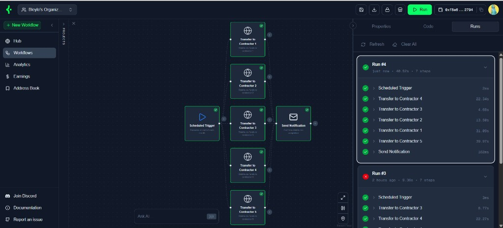

<div align="center">
  <h1>KeeperHub Agent Plugins</h1>
  <p><strong>Umbrella repo: shared MCP clients plus ElizaOS, OpenClaw, and Hermes KeeperHub plugins</strong></p>
  <p>Use <a href="https://app.keeperhub.com">KeeperHub</a> from agents via MCP. The <strong>ElizaOS</strong> plugin lives at <code>plugin-keeperHub/</code>; <strong>OpenClaw</strong> and <strong>Hermes</strong> integrations are sibling directories at the repo root for their respective CLIs and publish targets.</p>
</div>

<div align="center">
  <a href="https://github.com/Bleyle823/Keepers-Eliza-Plugin/blob/main/LICENSE"></a>
  <a href="https://docs.elizaos.ai/"></a>
  <a href="https://docs.openclaw.ai/"></a>
</div>

---

## What this repository is

This repository groups **[KeeperHub](https://app.keeperhub.com)** integrations for three agent stacks. All three talk to KeeperHub over **HTTPS MCP** at `https://app.keeperhub.com/mcp` using an **organization** API key (`kh_…` from Settings → API Keys → Organisation). **Do not** use `wfb_` user webhook keys for MCP — those are for webhook triggers only. Runtimes differ (ElizaOS vs OpenClaw vs Hermes).

### Layout and packages

| Stack | Path in this repo | Published / install identity |
| --- | --- | --- |
| **ElizaOS** (standalone plugin package) | [`plugin-keeperHub`](plugin-keeperHub) | **`@keeperhub/eliza-plugin`** (npm) |
| **OpenClaw** | [`openclaw-plugins/keeperHub`](openclaw-plugins/keeperHub) | **`@keeperhub/openclaw-plugin`** (npm + [ClawHub](https://docs.openclaw.ai/tools/clawhub)) |
| **Hermes** | [`hermes-plugins/keeperHub`](hermes-plugins/keeperHub) | **`keeperhub-hermes-plugin`** ([`pyproject.toml`](hermes-plugins/keeperHub/pyproject.toml)) |

### Capability overview

| Surface | Purpose |
| --- | --- |
| **ElizaOS** | KeeperHub MCP as **Eliza actions** + service + context provider |
| **OpenClaw** | **`@keeperhub/openclaw-plugin`** — **28 typed `kh_*` tools** (TypeBox), Gateway-friendly |
| **Hermes** | Python plugin — **28 `kh_*` tools** aligned with OpenClaw (TUI / Telegram / other Hermes channels) |

### Try the plugins (hosted demos)

These links are an **easy on-ramp** to see each integration in action—no local install required for a first chat or click-through.

| Surface | Try it |
| --- | --- |
| **Eliza** (web client) | [ElizaOS client on Phala dstack](https://59ac278dbb08744b118f4f9c382ade7cfd0f508e-3000.dstack-pha-prod5.phala.network/) |
| **Hermes** (Telegram) | [@keeperhermes2_bot](https://t.me/keeperhermes2_bot) |
| **OpenClaw** (Telegram) | [@keeperHub2_bot](https://t.me/keeperHub2_bot) (**Keeps**) |

**Personalised or production use** (your org, API keys, characters, Gateway, and infra) still means **setting up your own** Eliza, Hermes, or OpenClaw stack using the integration sections below—you cannot rely on shared demo hosts for customised workflows, credentials, or uptime.

---

## Features (KeeperHub)

- **Workflows** — list, create, update, delete, execute, search; AI-assisted generation where supported
- **Execution** — status and logs for workflow runs
- **Templates** — search, inspect, deploy into your org
- **DeFi & protocols** — discover and run protocol-oriented actions (e.g. Aave, Chainlink, Morpho, Uniswap, and others supported by KeeperHub)
- **Direct on-chain** — transfers, contract calls, conditional flows via configured wallet integrations
- **Marketplace** — search and invoke listed workflows (with sensible org fallbacks where applicable)
- **Integrations & schemas** — list integrations, wallet details, and action/plugin metadata

Detailed tool and action tables live in each plugin’s README (linked below).

---

## Case study: salary distribution on Base Sepolia from Eliza



This example shows a **[KeeperHub](https://app.keeperhub.com) workflow** used together with **`@keeperhub/eliza-plugin`**. The automation was designed in KeeperHub’s node editor: a **scheduled trigger** (runs at the start of each month) fans out into **five parallel native transfers**—one per contractor—and finishes with **Send Notification** once distribution completes. The **Runs** pane records each step so you get timing and outcomes without touching an explorer until you want receipts.

Five successful **Base Sepolia** transfers from that pattern are visible on [BaseScan Sepolia](https://sepolia.basescan.org/), for example:

| Transfer | Explorer |
| --- | --- |
| 1 | [Transaction `0xd289…fee8c`](https://sepolia.basescan.org/tx/0xd289ee29ef350fd3d30c0d180bb25b615b5b3f2b67783b60e8bb4702073fee8c) |
| 2 | [Transaction `0x037e…c2a7`](https://sepolia.basescan.org/tx/0x037efa2d26cc1c392bffc333a5b5cae0e9040aa2c9bd0bda0cbfade1c437c2a7) |
| 3 | [Transaction `0xce42…31e9`](https://sepolia.basescan.org/tx/0xce4296f4d46b07de59f7292c0186a3f7165c3d347f43f279980ab78cbc5f31e9) |
| 4 | [Transaction `0xe6f1…b1b7`](https://sepolia.basescan.org/tx/0xe6f1964e15f89988abbb37b075c1fde68ba027ec70a3184b335bf0f6f727b1b7) |
| 5 | [Transaction `0x1332…4bb`](https://sepolia.basescan.org/tx/0x133228870b4e001771bf7ab3e8908bf64a69a1fa7c4514ec760b6271a26d24bb) |

**Where Eliza fits.** You keep design, scheduling, and custody in KeeperHub (visual graph, organisation wallet integration, execution logs). From chat, Eliza invokes **KeeperHub actions**: list workflows, inspect runs, trigger execution when needed, and troubleshoot—instead of owning raw RPC wiring, nonce management across parallel sends, retries, or bespoke scripts for each payout lane.

**Why not “plain Eliza”?** Delivering five concurrent testnet payouts on a cadence—with verified hashes, sane error handling, and reproducible orchestration—is slow and brittle if you bolt **EVM wallets, multicall choreography, receipt polling, and human-readable status** entirely into Eliza prompts and custom code. The plugin routes that surface area through **KeeperHub’s MCP-backed workflow engine**, so the agent stays in natural language while execution stays deterministic and observable.

---

## Repository layout

```
├── packages/
│   ├── mcp-client/                 # @keeperhub/mcp-client (npm) — official MCP transport
│   └── keeperhub-mcp-client/       # keeperhub-mcp-client (PyPI) — Python port
├── plugin-keeperHub/              # @keeperhub/eliza-plugin (npm)
├── openclaw-plugins/
│   └── keeperHub/                 # @keeperhub/openclaw-plugin (npm / ClawHub)
└── hermes-plugins/
    └── keeperHub/                 # keeperhub-hermes-plugin (pip / PyPI)
```

All three plugins depend on the shared MCP clients above (no duplicated session/HTTP logic in plugin trees).

**Publishing:** see [`PUBLISHING.md`](PUBLISHING.md). **License:** [`LICENSE`](LICENSE) (MIT) and [`NOTICE`](NOTICE).

Run platform tooling from an [ElizaOS](https://github.com/elizaos/eliza), [OpenClaw](https://docs.openclaw.ai/), or [Hermes Agent](https://hermes-agent.nousresearch.com/) install; this repo ships the KeeperHub plugin packages and MCP libraries only.

---

## Prerequisites

**This repo (MCP clients + plugin packages):**

- **[Bun](https://bun.sh/docs/installation)** for TypeScript packages (`bun install` at repo root)
- **Python 3.9+** for Hermes plugin and `keeperhub-mcp-client` tests

**ElizaOS (`@keeperhub/eliza-plugin`):** an ElizaOS runtime that provides **`@elizaos/core`** (peer dependency). See [docs.elizaos.ai](https://docs.elizaos.ai/).

**OpenClaw:** Gateway/CLI and config per [OpenClaw documentation](https://docs.openclaw.ai/). Consume **`openclaw-plugins/keeperHub`** from this repo or from npm / ClawHub.

**Hermes:** Hermes Agent and plugins directory — [`hermes-plugins/keeperHub/README.md`](hermes-plugins/keeperHub/README.md).

> **Windows:** ElizaOS and some agent CLIs often recommend **WSL 2** for the full dev experience. Native Windows works for MCP client and plugin unit tests in this repo; use WSL if your host runtime tooling fails.

---

## Developers: clone and run tests

```bash
git clone https://github.com/Bleyle823/Keepers-Eliza-Plugin.git
cd Keepers-Eliza-Plugin

bun install
bun run build:mcp-client
bun test
```

Root scripts (see [`package.json`](package.json)):

```bash
bun run test:mcp-client      # @keeperhub/mcp-client
bun run test:openclaw        # @keeperhub/openclaw-plugin
bun run test:eliza-plugin    # @keeperhub/eliza-plugin
bun run build:eliza-plugin   # build Eliza plugin dist/
```

Hermes and Python MCP client (from repo root):

```bash
cd packages/keeperhub-mcp-client && pip install -e ".[dev]" && pytest
cd ../../hermes-plugins/keeperHub && pip install -e ".[dev]" && pytest
```

Eliza plugin manual test ideas: [`plugin-keeperHub/TESTING_GUIDE.md`](plugin-keeperHub/TESTING_GUIDE.md).

---

## Clone plugin trees and publish

### Full clone

```bash
git clone https://github.com/Bleyle823/Keepers-Eliza-Plugin.git
cd Keepers-Eliza-Plugin
```

### Sparse checkout (one plugin folder)

```bash
git clone --filter=blob:none --no-checkout https://github.com/Bleyle823/Keepers-Eliza-Plugin.git keeperhub-plugins
cd keeperhub-plugins
git sparse-checkout init --cone
# Choose one:
git sparse-checkout set openclaw-plugins/keeperHub
# git sparse-checkout set hermes-plugins/keeperHub
# git sparse-checkout set plugin-keeperHub
# git sparse-checkout set packages/mcp-client
git checkout main
```

### Publish ElizaOS (`@keeperhub/eliza-plugin`)

From [`plugin-keeperHub`](plugin-keeperHub) (see [`PUBLISHING.md`](PUBLISHING.md) for MCP client publish order and dependency pins):

```bash
cd plugin-keeperHub
bun install
bun run build
bun test
npm publish --access public
```

Consumers install with `bun add @keeperhub/eliza-plugin` / `npm install @keeperhub/eliza-plugin`.

If you vendor this package inside a full [ElizaOS](https://github.com/elizaos/eliza) monorepo, copy or symlink `plugin-keeperHub` to `packages/plugin-keeperHub` and use `workspace:*` for `@keeperhub/mcp-client` there.

### Publish OpenClaw (npm / ClawHub)

From [`openclaw-plugins/keeperHub`](openclaw-plugins/keeperHub):

```bash
cd openclaw-plugins/keeperHub
bun install
bun run build    # also runs via prepublishOnly on publish
npm publish      # package name: @keeperhub/openclaw-plugin — see package.json
```

For registry publication on **ClawHub** so users can `openclaw plugins install @keeperhub/openclaw-plugin`, follow [OpenClaw ClawHub docs](https://docs.openclaw.ai/tools/clawhub) and [`openclaw-plugins/keeperHub/README.md`](openclaw-plugins/keeperHub/README.md). See also [`PUBLISHING.md`](PUBLISHING.md).

### Publish Hermes (PyPI)

From [`hermes-plugins/keeperHub`](hermes-plugins/keeperHub):

```bash
cd hermes-plugins/keeperHub
pip install build twine
# bump version in pyproject.toml
python -m build
twine upload dist/*
```

This publishes **`keeperhub-hermes-plugin`** with the `hermes_agent.plugins` entry point declared in [`pyproject.toml`](hermes-plugins/keeperHub/pyproject.toml).

---

## KeeperHub API key

Create an organisation API key in the KeeperHub app: [app.keeperhub.com](https://app.keeperhub.com) → **Avatar → API Keys → Organisation → New API Key**.

Set one of (the Eliza plugin and both portable plugins accept these names in their respective environments):

```env
KH_API_KEY=kh_your_key_here
# aliases also supported:
# KEEPERHUB_API_KEY=...
```

Never commit real keys. Use `.env` / your host’s secret store. The repo root [`.gitignore`](.gitignore) excludes `.env` and build artifacts.

---

## Integrating the ElizaOS plugin (`@keeperhub/eliza-plugin`)

**Use this path in your ElizaOS app or install from npm.** Register **`@keeperhub/eliza-plugin`** on your agent runtime / character `plugins` array.

**1. Path dependency (this repo)**

The package lives at [`plugin-keeperHub`](plugin-keeperHub). From the repo root, `bun install` links it with `@keeperhub/mcp-client` via workspaces. In your ElizaOS project, depend on the folder or on the published npm package.

**2. Published NPM**

```bash
bun add @keeperhub/eliza-plugin
```

**3. Register the plugin and secrets**

- Add **`KH_API_KEY`** to the agent environment (or your deployment secrets manager).
- Register the plugin on your agent runtime / character `plugins` array.

Minimal pattern:

```typescript
import keeperhubPlugin from '@keeperhub/eliza-plugin';

// When building AgentRuntime / character config:
plugins: [
  // ...other plugins
  keeperhubPlugin,
],
```

**4. Character strings**

Point the model at KeeperHub for workflow and on-chain tasks in `system` / `bio` for consistent routing.

Full action list and examples: [`plugin-keeperHub/README.md`](plugin-keeperHub/README.md).

---

## Integrating the OpenClaw plugin (`@keeperhub/openclaw-plugin`)

Use OpenClaw’s Gateway and CLI (`openclaw.json`, env, etc.) as described in [OpenClaw plugin docs](https://docs.openclaw.ai/tools/plugin). Recommended install is **`openclaw plugins install @keeperhub/openclaw-plugin`** or **`clawhub:@keeperhub/openclaw-plugin`** — see [`openclaw-plugins/keeperHub/README.md`](openclaw-plugins/keeperHub/README.md).

**From a checkout of this repo:**

1. Ensure **`openclaw-plugins/keeperHub`** exists on disk (full clone or sparse checkout above).
2. On the **machine and working directory where you manage OpenClaw** (your OpenClaw project / install), install the plugin by pointing OpenClaw at that directory. Example — adjust `PATH_TO_REPO` to where you cloned **this** repo (or move the folder next to your OpenClaw config):

```bash
# Run from YOUR OpenClaw context; PATH_TO_REPO/openclaw-plugins/keeperHub must exist on that machine.
openclaw plugins install PATH_TO_REPO/openclaw-plugins/keeperHub
openclaw gateway restart
```

**Configure the API key** in **that** OpenClaw environment (OpenClaw config or env — see plugin doc):

```bash
openclaw config set plugins.entries.keeperHub.config.apiKey "kh_your_key_here"
# or rely on KH_API_KEY / KEEPERHUB_API_KEY
```

**Verify:**

```bash
openclaw plugins inspect keeperHub --runtime --json
```

Then have the agent call **`kh_status`**.

Complete install options (npm / ClawHub), tool table, architecture, and publishing: [`openclaw-plugins/keeperHub/README.md`](openclaw-plugins/keeperHub/README.md) and [OpenClaw plugin docs](https://docs.openclaw.ai/tools/plugin).

---

## Integrating the Hermes plugin

Install into **[Hermes Agent](https://hermes-agent.nousresearch.com/)** using its plugins directory and CLI. Source for this integration: [`hermes-plugins/keeperHub`](hermes-plugins/keeperHub).

1. Obtain **`hermes-plugins/keeperHub`** from a clone or archive of **this repository** (or **`pip install keeperhub-hermes-plugin`** after it is published—see [Publish Hermes (PyPI)](#publish-hermes-pypi)).
2. On the host where Hermes runs, install into Hermes’s plugin location (adapt paths if your distro uses another plugins root):

**Directory install (typical):**

```bash
# PATH_TO_REPO = where you cloned this repo on the Hermes machine
cp -r PATH_TO_REPO/hermes-plugins/keeperHub ~/.hermes/plugins/keeperHub
hermes plugins enable keeperHub
```

**Editable pip install** (optional — for hacking on the plugin; still use Python/Hermes on **that** side):

```bash
cd PATH_TO_REPO/hermes-plugins/keeperHub
pip install -e ".[dev]"
```

**Environment:** `plugin.yaml` declares **`KH_API_KEY`**. Hermes can prompt on `hermes plugins install` and store values in Hermes’s **`.env`**.

**Tests** (developers, from a checkout of this repo):

```bash
cd hermes-plugins/keeperHub
pytest
```

Details: [`hermes-plugins/keeperHub/README.md`](hermes-plugins/keeperHub/README.md).

---

## Contributing and issues

Open issues and PRs on this repository. Prefer focused changes scoped to `plugin-keeperHub`, `openclaw-plugins/keeperHub`, `hermes-plugins/keeperHub`, or `packages/*`, with tests when possible.

---

## Upstream and credits

The **KeeperHub Eliza plugin** is [`plugin-keeperHub`](plugin-keeperHub) and targets [ElizaOS](https://github.com/elizaos/eliza) via **`@elizaos/core`**. **OpenClaw** and **Hermes** KeeperHub packages live at the repo root for npm / ClawHub and PyPI workflows.

If you cite Eliza in research, see the upstream [README](https://github.com/elizaos/eliza) for the recommended BibTeX entry.

---

## License

This project is licensed under the **MIT License**. See the [`LICENSE`](LICENSE) file for details.
